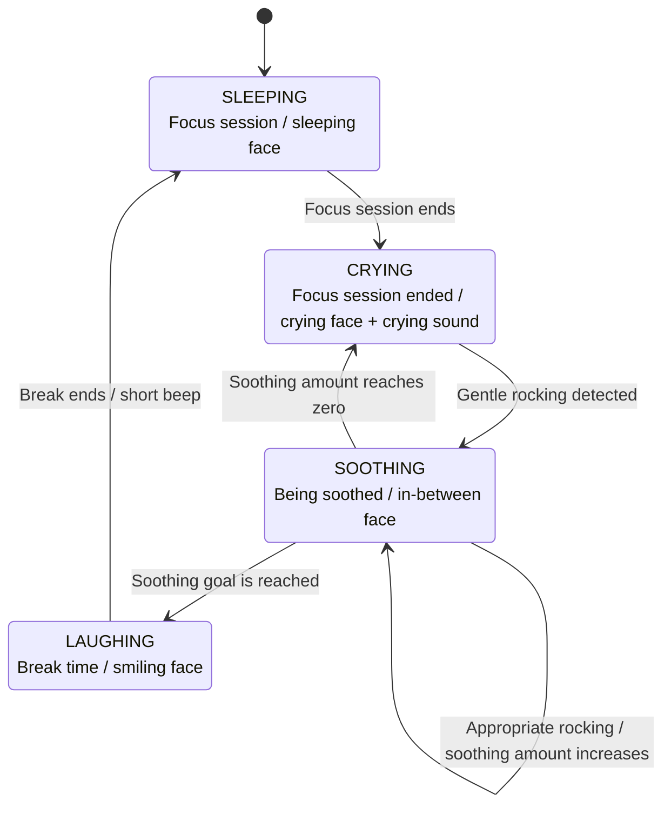

# Rock-a-Pomo

**Rock it gently to start your Pomodoro break.**

Rock-a-Pomo is a Pomodoro robot built with an M5StickC Plus2.  
When a focus session ends, it starts crying. To begin the break, you pick it up with both hands and gently rock it until it calms down.

- Hackster project: `TODO`
- Demo video: `TODO`

## Overview

Pomodoro timers are useful, but their notifications are easy to dismiss or ignore.

Rock-a-Pomo turns that notification into a physical interaction.

During a focus session, the robot sleeps quietly. When the timer ends, its display changes to a crying face and the built-in buzzer makes crying sounds.

To stop the crying, the user needs to hold the robot with both hands and gently rock it, like soothing a baby. Once it has been soothed enough, Rock-a-Pomo smiles and the break begins.

The outer body is intentionally larger than the M5StickC Plus2 itself. This encourages the user to take both hands away from the keyboard and mouse, creating a small physical transition out of work mode.

## Interaction Flow

Rock-a-Pomo repeats the following cycle:

1. Sleep during the focus session
2. Cry when the focus session ends
3. Detect gentle rocking with the built-in IMU
4. Increase the soothing amount while the motion is appropriate
5. Smile and start the break when soothing is complete
6. Sleep again after the break and start the next focus session

The robot manages its behavior by separating faces, sounds, timers, and motion detection into states.



The soothing amount increases only when the detected motion is neither too weak nor too strong.

If the user stops rocking before soothing is complete, the soothing amount gradually decreases. When it reaches zero, Rock-a-Pomo starts crying again.

## How Rock-a-Pomo Uses M5StickC Plus2

| Feature | Role in Rock-a-Pomo |
|---|---|
| Display | Shows facial expressions and the soothing amount |
| Buzzer | Plays crying sounds and notification beeps |
| IMU | Detects the gentle rocking motion |
| Built-in battery | Allows the robot to be held without a cable |
| ESP32 | Controls the timer, state transitions, display, sound, and IMU |

## Repository Structure

```text
rock-a-pomo/
├── README.md
└── firmware/
    └── rock_a_pomo/
        └── rock_a_pomo.ino
```

The final firmware is here:

[`firmware/rock_a_pomo/rock_a_pomo.ino`](./firmware/rock_a_pomo/rock_a_pomo.ino)

## Setup

<!-- TODO: Replace with the actual development environment and settings. -->

### Requirements

- M5Stack M5StickC Plus2
- Arduino IDE: `TODO`
- ESP32 board package: `TODO`
- M5Stack library: `TODO`
- Other libraries: `TODO`

### Uploading the Firmware

1. Install the required board package and libraries.
2. Open `firmware/rock_a_pomo/rock_a_pomo.ino`.
3. Select the board and port.
4. Upload the program to the M5StickC Plus2.
5. 3D print the outer body and mount the M5StickC Plus2.

<!-- TODO: Add the exact board settings and upload steps. -->

## Configuration

The following values can be changed in the source code:

- Focus duration
- Break duration
- Minimum rocking threshold
- Maximum rocking threshold
- Soothing increase speed
- Soothing decrease speed
- Required soothing amount

<!-- TODO: Add the actual variable names and default values. -->

## 3D Data

The outer body data will be added once the final submission assets are ready.

<!-- TODO: Add the actual print settings. -->
<!--
Printer:
Filament:
Layer height:
Infill:
Support:
-->

## Future Ideas

Possible future improvements include:

- A servo mechanism that moves the hands while the robot is crying
- A self-righting body structure that rocks from side to side
- Timer settings directly on the device
- Additional facial expressions and crying sounds

## License

<!-- TODO: Add the chosen license. -->

`TODO`

